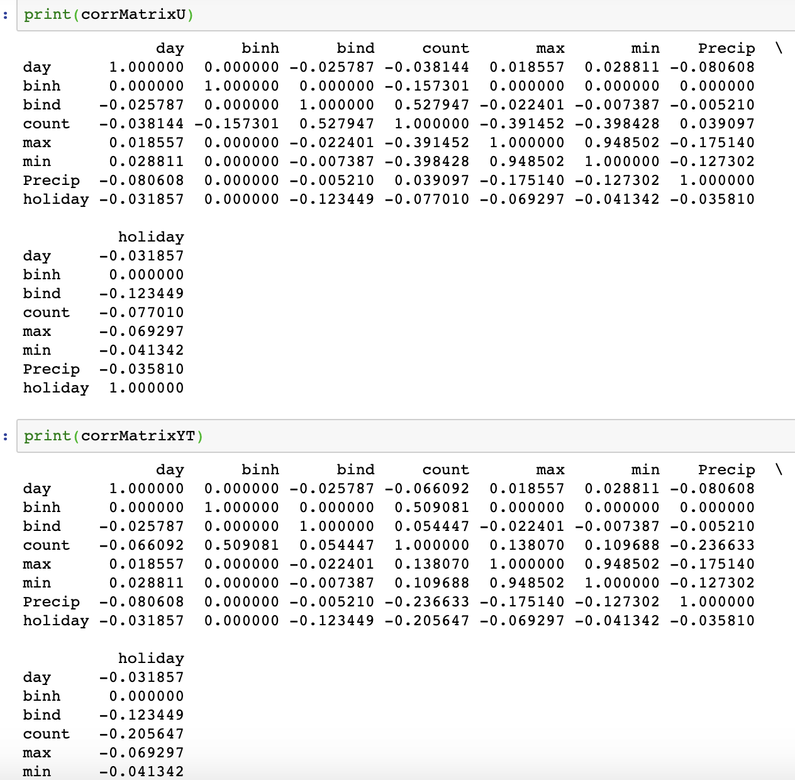
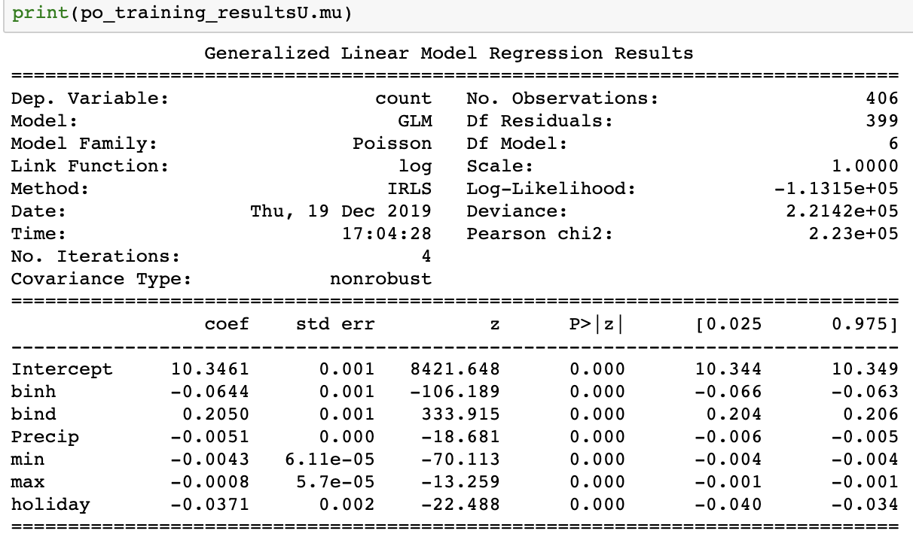
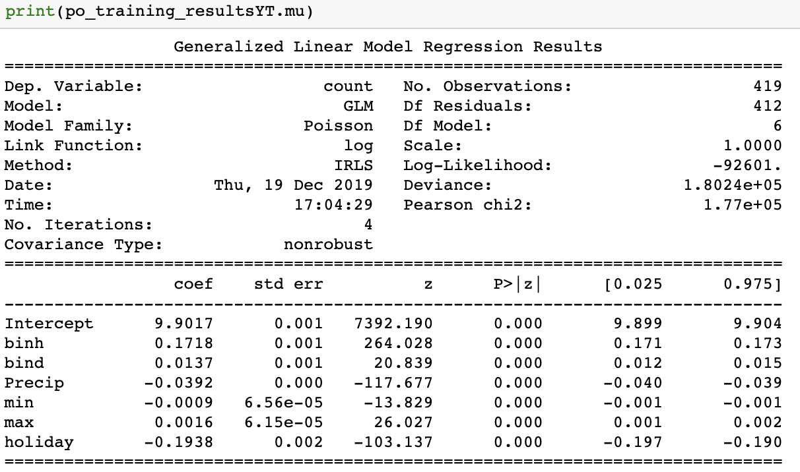
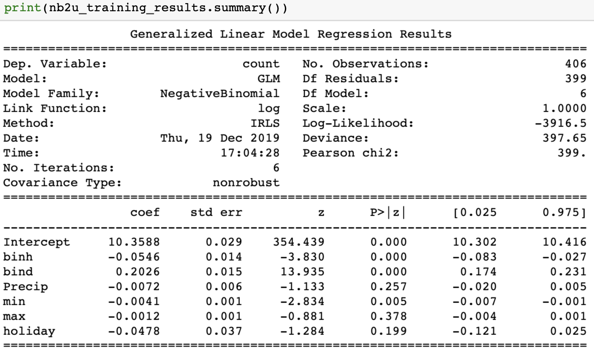
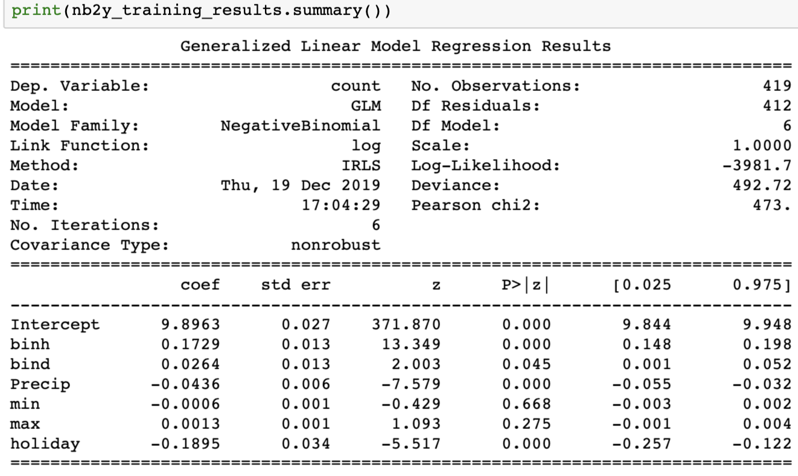

Data Visualization Dashboard
=========================================================

Analysis of competition between Uber and Yellow Taxi in New York City
=====================================================================

# Introduction
This project aims to analyse the competition between Uber Technologies Inc. (Uber) and New York City's Medallion 
(Yellow) taxi cabs companies in the New York City. Our targeted audience is the association of the yellow taxi drivers 
for whom we aim to show how their competitors in face of Uber company acquired the market traction over time and in 
which areas they mostly operate. We will also use additional factors like weather and time to explore the demand, key 
differences and highlight where Yellow Taxi could improve to stay competitive. The data for the analysis will be taken 
from NYC Taxi & Limousine Commission (TLC) for the period of Sep 2017 – March 2018.

It is first important to highlight that this competition is defined by the fact that these companies have different 
business models. Yellow Taxi business model can be characterized as a traditional product model where firm provides a 
service to the customers in direct dyadic relationship. Uber, on the other hand, is a prominent example of the “sharing 
economy” form of arrangement of economic and social exchange with its matchmaking business model where the company 
focuses on joining the customers and providers of the service through a platform. This key difference is defying the 
competition. However, since the service provided (vehicle for hire) is the same, the analysis can bring key insights on 
where Yellow Taxi can improve to stay competitive in the industry.

# Data
## Data Source
The data used for the analysis was acquired from the official website of the City of New York. From TLC Trip Record 
Data we took Yellow Taxi trip records data set, FHV trip records data set, Taxi Zone Shapefile and information from 
Trip Records User Guide about which base license number belongs to which company. That was done in order to choose only 
Uber from all FHV company bases.

Trip records for Yellow Taxi include fields capturing pick-up and drop-off dates/times, pick-up and drop-off locations, 
trip distances, itemized fares, rate types, payment types, and driver-reported passenger counts. The For-Hire Vehicle 
(“FHV”) trip records include fields capturing the dispatching base license number and the pick-up date, time, and taxi 
zone location ID.

The weather data set comes from National Climatic Data Center. Weather in New York central park is chosen to represent 
the weather in a whole city. The data set contains information such as precipitation, minimum and maximum temperature 
and public holidays in New York during the period of seven months. Public holidays are represented as binary data where 
1 is a holiday. This data set was only used to make regression analysis on demand for taxis.
Taxi Zone Shapefile and Borough boundaries include the geo data that keeps the coordinates of boundaries for zones and 
boroughs.

## Data Selection 
The trip records data sets for Yellow Taxi and FHV were chosen from September 2017 to March 2018 based on our first 
graph where it can be seen that during this time period Uber pulled ahead in terms of number of pickups in New York 
City. Moreover, this timespan reflects how Uber captured the market and continued to increase its popularity while the 
popularity of Yellow Taxi stagnated.

## Data preparation and Cleansing
We have created a code to make a data cleansing process automized for all data sets. It renames and drops unnecessary 
columns as well as chooses only Uber in FHV files. Furthermore, it automatically merges our data sets with company name 
file and taxi zone shapefile. Cleansing helped us to make everything in the same format and reduce the memory occupied 
by files on our server. In result we could include more months the analysis. Additionally, we noticed that Yellow Taxi 
trip record data had some date out of the range of the file. For instance, in the file for January 2018, there were 
records of rides from 2008 and 2007. Thus, we had to delete those automatically by cleansing. 

# Visualization outputs
## Tab 1: Trend graph for taxi market overview
### Objective and description
The objective of this graph is to show how competition between Yellow Taxi and Uber developed over time. On the graph, 
horizontal axis represents time period of our analysis with days as intervals. Considering that our time period is seven 
month, allowing to see the daily changes increases the details and insights seen on the graph. The vertical axis shows 
the number of trips in a range from 0 to 80 thousand. Overall, this line graph is a useful representation of how data 
has changed over time.

###  Key Insights

It can be seen that competition between Yellow taxi and Uber clearly developed through the time period of this graph. 
In the first two month Uber and Yellow Taxi have a consistent relationship with similar numbers of pickups every day 
with main difference that Uber had a higher peaks on the weekends and Yellow Taxi was more active during weekdays. 
Following to the November of 2017 Uber is seen to experience much significant peaks in number of rides on the weekends 
countervailing the lack of activity during weekdays. Other noticeable event is the plummeting or the Yellow Taxi number 
of rides on November 23rd which seems to be out of trend. The most important date on this graph is December 20th 2017 
this is because it was the day when Uber surpassed the Yellow Taxi and never had lover number of rides per day since. 
Lastly, the sharp drop of both companies rides on 4th January 2018 drew our attention and upon further inspection we 
found that it was due to the extreme blizzard which paralyzed the city (Weather.gov, 2019). This made us consider 
looking deeper into other conditions that affect number of rides, which will be explained in the regression part. 
Overall it can be seen that Uber has steady upward trend over this period, whereas Yellow Taxi stagnates. 

## Tab 2: Regression model
###  Objective
Based on the key insights of trend graph, we found that some factors like weather and weekend or not affect the demand 
for taxis. Therefore, in Tab 2 we decided to make a regression on demand for both Uber and Yellow Taxi to see what 
factors affect them mostly. In order to make the regression more precise, a total of 6 factors were considered:
-       Day or night (binary)
-       Weekend or not (binary)
-       Public holiday or not (binary)
-       Precipitation
-       Maximum temperature
-       Minimum temperature
The total number of observations is 424.

### Statistical analysis

*Note: We used random function to read all our data sets as we could not concatenate full ones. Thus the output for the 
correlation matrices, regression and the graph with predicted vs actual model will be always different. However, we ran 
the code several times and the trend is always the same as well as number are almost similar.*
Firstly, to make a good regression we created correlation matrices to see how independent variables are correlated to 
our dependent variable – number of pickups. From the outputs of these matrices it can be seen that some of the 
regression variables are highly correlated and some not. However, the most interesting thing is that those variables 
that have a weak correlation for Uber, at the same moment have a strong correlation for Yellow taxi. Thus we decided to 
keep and put them all in a regression.

The training and testing data sets are created. We have used *statsmodels and patsy* package to build the regression. 
By looking at our data which is binary and count we decided to employ discrete models such as Poisson. The output 
is following:

It shows that the p-values are good but Poisson model has an assumption that *variance = mean* that leads overdispersion 
that in our case can be seen in large numbers of Deviance and Log-Likelihood. So this model doesn’t fit well because of 
overdispersion. In order to deal with this problem, Negative Binomial Type 2 regression model was used as it does not 
make an assumption as Poisson model. Instead, the NB2 model requires us to define a new parameter  which it uses to 
express the variance in terms of the mean as follows: $$*.*$$ To get $$$$ we used technique developed by Cameron and 
Trivedi called *auxiliary OLS regression without a constant.* Then we train NB2 model on our training data set. The 
output is following:

From a goodness-of-fit perspective there are three things of interest in NB2 model’s training summary: Log-Likelihood, 
Deviance and Pearson chi2. The first statistic to look at is the Log-Likelihood value. The Maximum Log-likelihood has 
been generated by the Maximum Likelihood Estimation (MLE) technique that was executed by statsmodels during the training 
of the Poisson and the NB2 models. The MLE technique is used to fix the values of all the model coefficients to some 
optimal values which will maximize the likelihood of seeing the vector of counts y in the training data set.
The Likelihood-ratio test is used to compare how well two models fit the data. The LR test statistic is simply negative 
two times the difference in the fitted log-likelihoods of the two models.
In the case of Uber, the Log-likelihood for NB2 is -3916.5, while for the Poisson regression model it is -1.1315e+05. 
So the LR test statistic is $$2 * (1.1315e+05–3916.5) = 218,467$$. This value is vastly greater than the critical value 
of $$χ2(1)$$ at the 1% significance level which is 5.412.
In the case of Yellow Taxi, the Log-likelihood for NB2 is -3981.7, while for the Poisson regression model it is -92601. 
So the LR test statistic is $$2 * (92601–3981.7) = 177,238.6$$. This value is vastly greater than the critical value of 
$$χ2(1)$$ at the 1% significance level which is 5.412.
**As per the LR test, the trained NB2 regression model has demonstrated a much better goodness-of-fit on the bicyclists 
data set as compared the Poisson regression model.**
The reported values of Deviance and Pearson chi-squared for the NB2 model for Uber are 397.65 and 399 respectively. To 
make a quantitative determination of the goodness-of-fit at some confidence level, say 95% (p=0.05), we look up the 
value in the χ2 table for p=0.05 and Degrees of freedom of residuals=399. (DF Residuals = No. Observations minus DF 
model]). We compare this Chi-Squared value with the observed statistic — in this case it is the Deviance or the 
Pearson’s chi-squared value reported in GLM Results. We find that at p=0.05 and DF Residuals = 399, the chi-squared 
value from a standard Chi-Squared table is 447.632 which is bigger than the reported statistic of 397.65 or 399. So the 
model demonstrates a much better fit rather than Poisson model.
The reported values of Deviance and Pearson chi-squared for the NB2 model for Yellow Taxi are 492.72 and 473 
respectively. To make a quantitative determination of the goodness-of-fit at some confidence level, say 95% (p=0.05), 
we look up the value in the χ2 table for p=0.05 and Degrees of freedom of residuals=412. (DF Residuals = No. 
Observations minus DF model]). We compare this Chi-Squared value with the observed statistic — in this case it is the 
Deviance or the Pearson’s chi-squared value reported in GLM Results. We find that at p=0.05 and DF Residuals = 412, 
the chi-squared value from a standard Chi-Squared table is 447.632 which is bigger than the reported statistic of 
492.72 or 473. So the model demonstrates a much better fit rather than Poisson model.
**By looking at last tests we can conclude that the negative binomial model fits better on Uber data set rather than 
Yellow Taxi.**

### Key Insight
To visualize these outputs in some way, we plotted the predicted number of pickups versus actual number of pickups for 
the test data. These plots represent well how our predicted model fits the actual data.
The NB2 model seems to be more or less tracking the trend in the pickups count so it’s not too bad. But in some cases 
its predictions are way off the actual values. By comparing the graphs it can be mentioned that predicted model for 
Uber fits the actual data better than predicted model for Yellow Taxi.

From regression outputs it can be seen that the p-values and so significance of variables are different for Uber and 
Yellow Taxi. For Uber minimum temperature is significant and according to the correlation matrix means that the demand 
decreases for Uber during the cold weather. However, for the Yellow Taxi this variable is not significant. This may be 
due to the fact that Uber travels all over the city while Yellow Taxis are mainly only in the city center where it 
doesn’t matter what weather, there are always a lot of people. The variables weekend or not and day/night are 
significant for both Uber and Yellow Taxi meaning that this really has an effect on the demand so later we can look at 
it in more details. Precipitation variable is not significant for Uber showing that the snow or rain doesn’t disturb 
people to take an Uber. On the other hand, the demand for Yellow Taxi depends on the precipitation and according to 
correlations it leads to significant decrease in number of pickups. This difference could be based on the assumption 
that business models are different in terms of that Uber customer doesn’t need to catch the taxi on the street. Another 
interesting case is about holiday variable where it is significant for Yellow Taxi and not significant for Uber showing 
that during public holidays the number of pickups increases for Yellow Taxi and doesn’t matter for Uber. It can be deal 
with the assumption that celebrations of holidays always take part in the centre of the city, for example, Manhattan, 
where Yellow taxis dominate in terms of demand. The variable maximum temperature is not significant for both Uber and 
Yellow taxi so it doesn’t affect the demand. To conclude the variables vary between two companies and some of the 
factors can be considered as unique case for different business models.

## Tab 3:  Map of NYC, clock graph and bubble chart

### Objective
From tab 2 with statistic analysis, we can see that variables like locations, day and night, weekdays and weekends have 
significant influences on the number of pickups of Uber and Yellow Taxi. So in tab 3, we are going to look deeper 
insight of these variables and trying to find out how they contribute to the differences in number of pickups of Uber 
and Yellow Taxi in selected time.

### Description
This tab displays three graphs: map graph with a heatmap, clock graph and bubble chart that interact with each other. 
On the right side, there is a dashboard, setting for selecting time (month). When choosing a specific month, the data 
used to drawing the graphs will change accordingly.

Map graph shows the five boroughs of New York city with different filled colors in each zone. Additionally, map is used 
as a heatmap, where yellow to orange color spector represents that the total number of pickups of Yellow Taxi in 
selected month is bigger than the number of Uber, while dark blue reveals that the number of pickups of Uber is greater.

On the left bottom is Clock graph, in which small wedges in yellow and gray demonstrate the hourly average number of 
pickups of Yellow Taxi and Uber in a day. The background color of the annular shows the comparison of pickup numbers. 
If Uber takes more orders in that hour, the corresponding section will be displayed in blue, otherwise in pale yellow.

Bubble chart is located on the right bottom, showing the average number of daily pickups in seven weekdays via the size 
of bubbles.

By clicking one of five boroughs on the map, clock graph and bubble chart will change simultaneously to the information 
in that particular area. 

### Key Insights

Key insights are going to be structured as follows: firstly, the conclusions will be drawn from the heatmap based on 
boroughs and time, then the clock graph and bubble chart will be analysed together in relation to boroughs and time. 

On the map graph we applied heatmap on the neighbourhoods of each borough. This allows to see the popularity of each 
company based on the specific location. From the look at the map it becomes straightforward that Yellow Taxi operates 
mostly in a Manhattan borough and airports. In contrast, Uber seems to operate throughout all boroughs having the most 
pickups (almost 20 thousands) in the Crown Heights North neighbourhood of the Brooklyn in the september 2017. Throughout 
the month two we can see the development of the Uber in Brooklyn and Queens boroughs with Yellow Taxi not changing much. 
However, on month three it can be noticed that Uber took over couple neighbourhoods of Manhattan borough that were 
occupied by Yellow Taxi before. By the month 7 more neighbourhoods originally dominated by Yellow Taxi in the Manhattan: 
Lower East Side, Chinatown, Civic Centre, West Chelsea, Little Italy and Soho got higher pickups by Uber with Civic 
Centre peaking at 24 thousands rides. Nonetheless, based on the clock graph, total number of Yellow Taxi rides was still 
greater in Manhattan throughout the whole time. Upon further inspection it is seen that some boroughs have less pickups 
compared to other. For example, in 4 boroughs the amount of rides is measured in thousands, but in Staten Island number 
of pickups is on average under one thousand, thus the map is very pale in that region. This needs to be taken into 
consideration when concluding that Uber has higher popularity, because compared to Manhattan it is uncomparable amount 
of pickups. 

For the further inspection of how different parts of New York were affected by the competition we would turn to the 
clock graph and the bubble chart. These figures give better insights on how different boroughs use vehicle for hire 
services. Firstly, we will focus on the Manhattan borough. There it can be seen that pickups usually take place during 
evening rush hours during the weekdays and weekends. This can be explained by the fact that it is a centre of the city 
and many people catch taxi after work. In comparison, most populated outer borough of the New York - Brooklyn is not 
only dominated by Uber, but also is seen to have different pickups regime. Although it is still more active in the 
evening hours, there is more activity during weekend evenings and nights compared to weekdays. For instance, Uber has 
averagely more than 2 thousands pickups at hours after 6pm on Saturdays in month 5. This is also true for Queens, Staten 
Island and to some extend Bronx. Additionally, Uber is generally more active in a very late hours in comparison to 
Yellow Taxi. Lastly, the airports can be considered as exceptional cases as they don’t follow the borough they belong in 
regime. The popularity of the Yellow Taxi in the airports can be explained by the fact that most tourists associate New 
York with yellow taxis or that foreigners might not have internet or app to arrange Uber, so it’s more convenient to use 
traditional taxi services. 

Overall, these graphs reflect the results of regression discussed earlier. It is clear that the pickups regimes 
represent the contrast between business days and weekend nightlife of the NYC. This is then ties to the companies chosen 
by customers. The main insights for the Yellow Taxi company should be the noticeable difference between central and 
outer boroughs and the lack of the availability of Yellow Taxi during late night hours. 

# Conclusion

Overall this project successfully achieved its goals. We were able to analyse and illustrate the competition, 
emphasizing its development over time and in (space)different areas of New York. There are several main findings we 
would like to emphasise. Firstly, the trend graph has shown that Uber has got higher market traction over the period 
from September 2017 and March 2018, whereas Yellow Taxi stayed stagnant. This shift in the market should be taken as a 
sign that Yellow Taxis’ traditional product business model may have some disadvantages compared to Uber’s matchmaking 
business model. Upon further analysis by regression we found that different variables affect the demand for those 
companies differently. For instance, it was found that Yellow Taxi is much more affected by the bad weather compared to 
Uber, moreover, time (day or night) and day of the week (weekend or not) influenced the demand for both companies. 
Lastly, on our third tab, we presented detailed infographics which revealed new insights into the problem analyzed. It 
was found that Yellow Taxi has very limited area of operation is mainly in Manhattan and airports, whereas Uber has 
been operating in all boroughs even winning parts of central Manhattan by March 2018. This raises the question of the 
availability of Yellow Taxi services across the city as there are certainly neighbourhoods that have a demand for 
vehicle for hire services. Furthermore, clock graph and bubble chart revealed that Uber and Yellow taxi have different 
pickup regimes. Where Yellow Taxi is more active during evening rush hours on a weekday, but Uber is also active on the 
weekend nights across NYC. Moreover, Uber seems to be more available during the very late night hours. 

Taking all of the above into consideration, it can be concluded that Uber certainly presents a fierce competition to 
Yellow Taxi. Therefore, Yellow Taxi need to adapt to the changing market by improving the quality of the service and 
our project highlighted some areas to begin with. 

# Further Research

The results of our analysis are limited by the data available and further research could provide better insight into the 
competition. For example, analysis of prices of the rides could explain why different customers pick one company over 
the other. Other variables to look into could be: the comparison of demand during tourists seasons, availability of 
public transport or bicycles for hire, reviews from the customers, the quality of the vehicles et cetera.

# References

Ncdc.noaa.gov. (2019). National Centers for Environmental Information (NCEI) formerly known as National Climatic Data 
Center (NCDC) | NCEI offers access to the most significant archives of oceanic, atmospheric, geophysical and coastal 
data.. [online] Available at: https://www.ncdc.noaa.gov [Accessed 10 Dec. 2019].
 
Www1.nyc.gov. (2019). TLC trip record data. [online] Available at: 
https://www1.nyc.gov/site/tlc/about/tlc-trip-record-data.page [Accessed 10 Dec. 2019].
 
Businessmodelzoo.com. (2019). Business Model Zoo (TM), profit, platform, marketplace, customer, competition, cass. 
[online] Available at: http://www.businessmodelzoo.com [Accessed 10 Dec. 2019].
 
Baden-Fuller, C. and Mangematin, V. (2013) ‘Business models: A challenging agenda’, Strategic Organization, 11(4), 
pp. 418–427.
 
Weather.gov. (2019). January 4, 2018 Blizzard. [online] Available at: https://www.weather.gov/okx/Blizzard_Jan42018 
[Accessed 14 Dec. 2019].

